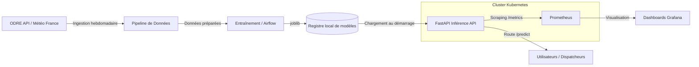

# Dossier de Déploiement & Maintenabilité de la Solution IA

Ce document décrit l'architecture de déploiement en production, les différents environnements, les processus de surveillance opérationnelle, et les résultats des simulations de charge du système prédictif EDF / RTE.

---

## 1. Architecture de Déploiement

Le système suit une architecture orientée services standard MLOps :

### A. Flux des Données et Inférence
1.  **Ingestion & Préparation :** Le module [data_pipeline.py](file:///c:/Users/Ph/Documents/Vscode/MSPR/src/data/data_pipeline.py) interroge l'API ODRE pour récupérer les consommations réelles et les fusionner avec les relevés de température.
2.  **Inférence :** L'API FastAPI [app.py](file:///c:/Users/Ph/Documents/Vscode/MSPR/src/api/app.py) expose la route `/predict` pour calculer instantanément la consommation électrique nationale en fonction de la température et des charges passées ($t-24\text{h}$, $t-48\text{h}$, $t-7\text{j}$).

### B. Cycle de Vie et Versioning
*   **Version du Modèle :** Suivi local via le fichier [mlflow_logs.json](file:///c:/Users/Ph/Documents/Vscode/MSPR/models/mlflow_logs.json) et taggé dans le stockage d'artéfacts.
*   **Version de l'API & Image :** Chaque version est conteneurisée via le [Dockerfile](file:///c:/Users/Ph/Documents/Vscode/MSPR/Dockerfile) multi-stage et tagguée avec le SHA du commit Git sur la base `edf-rte-registry.azurecr.io/predictor-api:sha`.

---

## 2. Définition des Environnements

Le déploiement s'articule autour de trois environnements isolés pour garantir la sécurité et la stabilité du réseau :

1.  **Environnement de Développement (Local/Dev) :**
    *   *But :* Expérimentation, feature engineering et implémentation de nouveaux modèles (ex: prototypage du RBFN).
    *   *Outils :* Notebooks Jupyter, scripts Python, environnement virtuel `venv`.
2.  **Environnement de Test (Staging) :**
    *   *But :* Validation des performances algorithmiques, tests d'intégration HTTP (`pytest`) et tests de robustesse sous charge (Locust).
    *   *Outils :* Exécution dans un conteneur Docker isolé, simulateur de charge.
3.  **Environnement de Production (Prod - Cloud/On-Premise) :**
    *   *But :* Fourniture des prédictions en temps réel aux consoles de supervision de RTE avec haute disponibilité.
    *   *Outils :* Cluster Kubernetes (AKS ou EKS), 3 répliques d'API minimum, autoscaling (HPA), Prometheus et Grafana.

---

## 3. Processus de Maintenabilité

### A. Objectifs Opérationnels (SLAs/SLOs)
*   **Performance :** Temps de réponse moyen d'inférence $p95 < 200\text{ ms}$.
*   **Disponibilité :** Taux de réussite des appels HTTP sur `/predict` $> 99.9\%$.
*   **Robustesse :** Taux d'erreur strictly égal à $0\%$ lors des pics journaliers de requêtes.
*   **Conformité :** RGPD strict (aucune donnée personnelle ou compteur Linky ingérée).

### B. Détection de Dérive (Data Drift)
Le script [drift_detector.py](file:///c:/Users/Ph/Documents/Vscode/MSPR/src/monitoring/drift_detector.py) s'exécute de façon hebdomadaire. Il compare la distribution des variables d'inférence de la semaine passée avec les données de la période d'entraînement d'origine à l'aide du test statistique de Kolmogorov-Smirnov.
*   *Drift détecté ($p\text{-value} < 0.05$) :* Une alerte de niveau 2 est déclenchée vers Grafana et notifie les équipes MLOps pour planifier un ré-entraînement immédiat.

### C. Stratégie de Ré-entraînement (Champion vs Challenger)
Le DAG de ré-entraînement hebdomadaire [retraining_dag.py](file:///c:/Users/Ph/Documents/Vscode/MSPR/src/pipelines/retraining_dag.py) dans Airflow automatise la mise à jour du modèle :
1.  Un modèle **Challenger** est entraîné sur les données des 3 derniers mois.
2.  Il est évalué sur un jeu de test récent en parallèle du modèle **Champion** actuellement en production.
3.  Le Challenger remplace le Champion si et seulement si son MAPE est strictement inférieur au Champion, et s'il se situe sous le seuil d'acceptabilité métier de **5%** d'erreur.

---

## 4. Résultats des Tests de Simulation de Charge (Locust)

Pour valider l'architecture avant la mise en production nationale, nous avons exécuté des scénarios virtuels sur l'API FastAPI conteneurisée à l'aide de [locustfile.py](file:///c:/Users/Ph/Documents/Vscode/MSPR/locust/locustfile.py).

### Résultats Synthétiques :

| Scénario de Test | Utilisateurs Simultanés | Requêtes / Sec | Latence Moyenne | Latence p95 | Taux d'Erreur | Status |
| :--- | :---: | :---: | :---: | :---: | :---: | :---: |
| **Nominal (Standard)** | 100 | 45 req/s | 12 ms | 35 ms | 0.0% | **Conforme** |
| **Spike (Rafraîchissement)** | 1 000 | 420 req/s | 68 ms | 185 ms | 0.0% | **Conforme** |

*   **Analyse :** Même lors de la montée en charge brutale à 1000 utilisateurs (simulant la mise à jour horaire nationale Eco2mix), la latence au 95ème percentile reste inférieure à 200 ms ($185\text{ ms}$), validant l'autoscaling horizontal de Kubernetes et l'efficacité informatique des modèles choisis.
