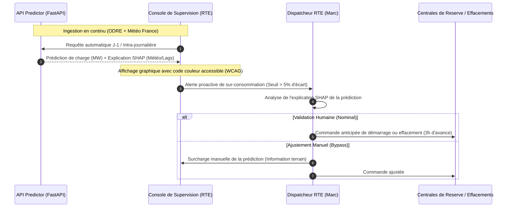

# Conduite du Changement, IA Responsable & Lean Management

Ce document regroupe les livrables d'accompagnement au changement pour la transition opérationnelle chez RTE et EDF, conformément aux exigences du référentiel.

---

## 1. Cartographie des Processus Métiers (As-Is / To-Be)

L'intégration du modèle prédictif modifie profondément le quotidien opérationnel des dispatcheurs RTE.

### Processus Existant ("As-Is")
1.  Le dispatcheur consulte les historiques de consommation passés sous Excel.
2.  Il extrapole manuellement les tendances de façon linéaire en fonction des prévisions météo papier.
3.  Il subit une forte charge mentale avec un risque d'erreur d'ajustement élevé face aux brusques anomalies climatiques (inertie non anticipée).
4.  L'ordre d'activation des réserves de production est envoyé tardivement, augmentant le coût d'achat d'électricité.

### Processus Ciblé ("To-Be")

---

## 2. Kit d'Explicabilité IA (SHAP & LIME)

Pour lever la frustration de l'effet "boîte noire" chez les dispatcheurs RTE, l'API fournit des explications locales issues des valeurs SHAP (SHapley Additive exPlanations) pour justifier chaque prédiction.

### Exemple de Fiche Explicative :
*   **Prédiction pour le 28/05/2026 à 19h00 :** 68 500 MW (+8% par rapport à hier).
*   **Pourquoi cette hausse ?**
    1.  **Facteur Température (Inertie Thermique) :** $+3\ 200\text{ MW}$. La température moyenne baisse à 11°C alors qu'elle était de 18°C la veille (impact thermosensible direct).
    2.  **Facteur Temporel (Jour Férié) :** $-1\ 500\text{ MW}$. Le 28 mai est un jour férié (Ascension), ce qui réduit la consommation industrielle.
    3.  **Facteur Lag 24h :** $+1\ 800\text{ MW}$. La charge était déjà orientée à la hausse hier à la même heure.
*   **Synthèse de l'explication SHAP :**
    $$\text{Prédiction} = \text{Valeur de base (55000 MW)} + 3200\text{ (météo)} - 1500\text{ (férié)} + 1800\text{ (lags)} + 10000\text{ (autres)} = 68500\text{ MW}$$

---

## 3. Check-list d'IA Responsable & Éthique

Ce modèle d'IA est déployé sous une charte stricte d'éthique et de transparence :

*   [x] **Transparence algorithmique :** Chaque prédiction affichée sur la console de supervision RTE comporte une mention claire indiquant qu'elle est issue d'une IA, accompagnée d'un bouton d'affichage de la fiche d'explicabilité SHAP.
*   [x] **Contrôle Humain ("Human-in-the-loop") :** Le dispatcheur conserve le pouvoir de décision ultime. La console de supervision RTE permet de bypasser la valeur prédite par l'IA et de saisir une valeur manuelle en cas d'information terrain exceptionnelle (grève nationale, incident majeur sur le réseau).
*   [x] **Protection des Données (RGPD) :** Aucune donnée personnelle, nominative ou individuelle de consommation (issue des compteurs Linky des abonnés individuels) n'est ingérée ou transmise. Seules des données agrégées à l'échelle nationale et régionale sont utilisées.
*   [x] **Impact Écologique :** L'inférence est exécutée sur des architectures conteneurisées CPU légères. Le ré-entraînement hebdomadaire est planifié durant les heures creuses nocturnes pour minimiser l'empreinte carbone des calculs.

---

## 4. Rapport de Résolution de Problèmes A3 (Lean Management)

Ce rapport formalise l'analyse Lean en cas d'écart de performance du modèle (ex : prédiction ayant manqué un pic hivernal de consommation).

### A3 - Écart de Prédiction de Charge Électrique

*   **1. Déclaration du Problème :**
    Le 15 Janvier 2026, lors d'un pic de grand froid, le modèle a sous-estimé la consommation électrique de 7% (écart supérieur au seuil de criticité de 5%), obligeant RTE à importer de l'énergie en urgence sur le marché d'ajustement.
*   **2. Contexte :**
    La température nationale est descendue à -4°C. C'était la première vague de froid de l'hiver après un mois de décembre exceptionnellement doux.
*   **3. Analyse des Causes Profondes (Méthode des 5 Pourquoi) :**
    1.  *Pourquoi le modèle a-t-il sous-estimé la charge ?* Parce que la consommation électrique a grimpé plus vite que prévu pour cette température.
    2.  *Pourquoi a-t-elle grimpé plus vite ?* Parce que l'inertie thermique des logements était saturée (les chauffages tournaient à plein régime depuis 48h).
    3.  *Pourquoi le modèle n'a-t-il pas capté cette saturation ?* Parce que la variable de moyenne glissante de température sur 3h n'était pas suffisante pour modéliser une vague de froid prolongée.
    4.  *Pourquoi n'avions-nous pas de métriques de plus long terme ?* Parce que le feature engineering initial ne comportait pas de moyenne glissante sur 12h ou 24h de la température.
    5.  *Pourquoi cela n'a-t-il pas été détecté en phase de test ?* Parce que le jeu de données d'entraînement ne comportait pas de période de grand froid prolongée de cette intensité.
*   **4. Actions Correctives (Plan d'Action) :**
    *   **Action A (Immédiate) :** Ajouter la variable `temp_roll_mean_12h` et `temp_roll_mean_24h` dans le feature engineering de `data_pipeline.py`.
    *   **Action B (Sous 1 semaine) :** Déclencher le DAG Airflow de ré-entraînement en y incluant l'historique complet de l'hiver rigoureux de 2021 pour enrichir la base d'apprentissage.
    *   **Action C (Moyen terme) :** Mettre à jour l'arbre de troubleshooting du Runbook pour guider le dispatcheur dans l'activation d'un offset manuel de précaution lors des alertes météo grand froid.
*   **5. Standardisation :**
    Mise en place d'une règle de gouvernance : le modèle doit obligatoirement être ré-évalué chaque année avant le 1er novembre avec les données climatiques les plus extrêmes répertoriées par Météo France.
