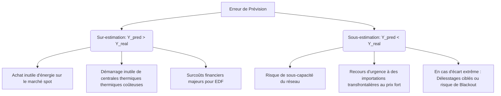

# Matrice RACI & Cartographie des Acteurs

Ce document cartographie l'écosystème du projet de prédiction de consommation électrique EDF / RTE, facilitant la collaboration entre la Direction de l'Innovation d'EDF (et ses 9 centres R&D mondiaux) et RTE.

---

## 1. Matrice RACI (Responsible, Accountable, Consulted, Informed)

| Tâches / Activités | Direction Innovation EDF (Sponsor) | Dispatcheurs RTE (Experts métiers) | Scrum Master | Data Scientists / Engineers | Ingénieur MLOps |
| :--- | :---: | :---: | :---: | :---: | :---: |
| **Cadrage & Spécification des besoins** | **A** | **C** | **R** | **C** | **I** |
| **Ingestion & Feature Engineering** | **I** | **I** | **I** | **R** / **A** | **C** |
| **Entraînement & Validation IA** | **I** | **C** | **I** | **R** / **A** | **C** |
| **Industrialisation (FastAPI, Docker, K8s)** | **I** | **I** | **I** | **C** | **R** / **A** |
| **Pipeline CI/CD & Sécurité** | **I** | **I** | **I** | **I** | **R** / **A** |
| **Monitoring Drift & DAG Airflow** | **I** | **C** | **I** | **C** | **R** / **A** |
| **Conduite du changement & Formations** | **A** | **R** | **R** | **C** | **C** |

* **R (Responsible) :** Réalise l'action.
* **A (Accountable) :** Approuve et valide l'action (un seul par ligne).
* **C (Consulted) :** Donnes des avis, conseils ou informations.
* **I (Informed) :** Est tenu informé des avancées.

---

## 2. Personas Métiers

### Persona 1 : Marc, 45 ans – Dispatcheur National chez RTE
* **Profil :** Plus de 15 ans d'expérience dans l'exploitation de réseaux électriques. Travaille par quarts (3x8) au centre national de supervision.
* **Objectif métier :** Maintenir en temps réel l'équilibre offre-demande sur le réseau français à 50Hz.
* **Besoin clé :** Disposer de prévisions fiables à la demi-heure près pour planifier l'activation ou l'effacement de capacités de secours (centrales thermiques de pointe, importations).
* **Frustrations :**
  * Il n'a pas confiance dans les modèles "boîte noire" qui ne justifient pas leurs variations.
  * Il craint les faux positifs météo qui déclenchent des démarrages de centrales coûteux et polluants.
* **Rapport à l'IA :** Exige une interface transparente avec explicabilité locale (ex: "Pourquoi la prévision de 18h grimpe de 2 GW alors que le ciel semble dégagé ?").

### Persona 2 : Léa, 29 ans – Analyste du Mix Énergétique chez EDF
* **Profil :** Jeune diplômée en finance de l'énergie et économie. Travaille à la direction Trading & Portfolio Management d'EDF.
* **Objectif métier :** Optimiser les flux d'achats/ventes d'électricité sur les marchés SPOT (EPEX SPOT) à horizon J-1 et intra-journalier.
* **Besoin clé :** Anticiper les volumes de production et de consommation des clients EDF pour minimiser le coût d'écart facturé par RTE.
* **Frustrations :**
  * Le manque de flexibilité des prévisions classiques qui intègrent mal l'inertie thermique des bâtiments.
  * Des temps d'accès aux prévisions trop lents durant les sessions de marché rapides.
* **Rapport à l'IA :** Demande un modèle performant, scalable, accessible via une API ultra-rapide et sécurisée.

---

## 3. Matrice de Criticité des Prévisions (Impacts Métiers)

Les erreurs de prévision de consommation ont des impacts asymétriques très lourds sur le réseau et l'économie :

### Grille de Seuils de Criticité :

1. **Zone Verte (Écart < 3% - MAPE nominal) :**
   * *Statut :* Excellent.
   * *Impact :* Gestion fluide, équilibre optimal du réseau, coûts d'écarts minimisés.
2. **Zone Orange (Écart entre 3% et 5% - Alerte de dérive) :**
   * *Statut :* Vigilance.
   * *Impact :* Activation légère des réserves secondaires de RTE. EDF subit des pénalités financières modérées sur le marché d'ajustement.
3. **Zone Rouge (Écart > 5% - Incidents d'exploitation) :**
   * *Statut :* Critique.
   * *Impact :* Risque physique sur le réseau (fréquence < 49.8 Hz). Obligation d'activer les contrats d'effacement industriel ou de lancer en urgence des turbines à gaz polluantes. Coûts de pénalités majeurs.
