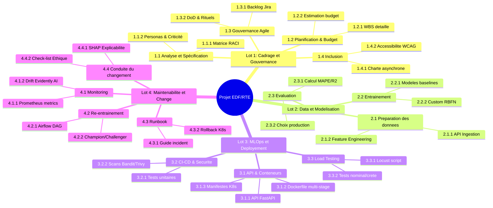

# WBS (Work Breakdown Structure) & Modélisation Budgétaire

Ce document détaille la planification macro et la répartition financière fictive du projet (basée sur 38 heures d'effort).

---

## 1. WBS (Work Breakdown Structure) à 3 Niveaux

---

## 2. Estimation des Charges (Méthode Planning Poker)

Répartition basée sur une équipe projet de 4 personnes (total : 38 heures de travail effectif). Les tâches individuelles n'excèdent pas 4 heures.

| Code WBS | Nom de la tâche | Rôle affecté | Estimation (h) |
| :--- | :--- | :--- | :---: |
| **1.1.1** | Cartographie des acteurs, personas & matrice RACI | Scrum Master / PO | 2 h |
| **1.2.2** | Modélisation budgétaire et planification WBS | Scrum Master | 2 h |
| **1.3.2** | Initialisation du backlog agile, tickets et DoD | Scrum Master | 2 h |
| **1.4.2** | Rédaction du plan d'inclusion et d'accessibilité | Scrum Master / PO | 2 h |
| **2.1.1** | Développement du script d'ingestion API ODRE | Data Engineer | 3 h |
| **2.1.2** | Feature Engineering (lags, encodage cyclique, rolling) | Data Scientist | 4 h |
| **2.2.1** | Entraînement modèles classiques (Arbre, RF, KNN) | Data Scientist | 3 h |
| **2.2.2** | Conception et validation du réseau custom RBFN | Data Scientist | 4 h |
| **2.3.1** | Script d'évaluation comparative et dashboard local | Data Scientist | 2 h |
| **3.1.1** | Développement de l'API FastAPI (/predict et /health) | MLOps Engineer | 3 h |
| **3.1.2** | Dockerisation sécurisée non-root et multi-stage | MLOps Engineer | 2 h |
| **3.1.3** | Écriture des manifestes K8s (Deployment, Service, HPA) | MLOps Engineer | 2 h |
| **3.2.1** | Écriture des tests unitaires et intégration (Pytest) | Data Scientist / MLOps | 3 h |
| **3.2.2** | Configuration de la CI/CD (GitHub Actions, Bandit, Trivy) | MLOps Engineer | 2 h |
| **4.1.2** | Script de monitoring de drift Evidently AI & metrics | MLOps Engineer | 2 h |
| **4.2.1** | Modélisation du DAG Airflow pour le ré-entraînement | Data Engineer / MLOps | 3 h |
| **4.3.1** | Rédaction du Runbook et scripts d'urgence | MLOps Engineer | 2 h |
| **5.1.1** | Analyse d'impact métier, BPMN et explicabilité SHAP | Product Owner / DS | 3 h |
| **Total** | | | **48 h-homme** (réparties sur 12h réelles à 4 pers.) |

---

## 3. Budget Fictif de Fonctionnement (Coût Total de Possession - TCO)

Ce budget projette les coûts sur une année de production complète (incluant la phase projet et la phase run).

### A. Coûts des Ressources Humaines (Phase Projet)
* **Taux Journalier Moyen (TJM) :** 500 € / jour par personne (soit 62,50 € / heure).
* **Effort total :** 48 heures-homme de travail.
* **Coût RH Projet :** $48\text{ h} \times 62,50\text{ €/h} = 3\ 000\text{ €}$.

### B. Coûts d'Infrastructure Cloud (Annuel)
1. **Environnement de Calcul (Entraînement & Inférence) :**
   * *Instances CPU/GPU managées (AWS EKS - Cluster de production)* : 3 Pods en permanence sur des VM `t3.medium` pour l'API (environ 50€/mois par instance) + instances GPU `g4dn.xlarge` allouées dynamiquement pour le ré-entraînement hebdomadaire (2h/semaine à 1,50€/h).
   * *Coût annuel calcul :* $(3 \times 50\text{ €} \times 12\text{ mois}) + (2\text{h} \times 52\text{ sem} \times 1.50\text{ €}) = 1\ 800\text{ €} + 156\text{ €} = 1\ 956\text{ €}$.
2. **Stockage des Données (Historique de consommation) :**
   * *Base SQL ou Cloud Object Storage (S3)* : Stockage de 5 ans d'historique (demi-horaire RTE + Synop Météo) = 20 Go avec réplication et logs.
   * *Coût annuel stockage :* 20 Go x 0.023€/Go/mois = 5,52€/an (négligeable).
3. **MLOps & Monitoring SaaS (MLflow, Grafana Cloud, Docker Registry) :**
   * Formules gratuites/community avec quotas d'exploitation standard.
   * *Coût annuel outils :* 0 €.

### Synthèse du Budget (TCO An 1) :

| Postes de dépenses | Coût Phase Projet | Coût Phase Run (Annuel) | Total An 1 |
| :--- | :---: | :---: | :---: |
| **Ressources Humaines** | 3 000 € | - | 3 000 € |
| **Calcul Cloud (Kubernetes & GPU)** | - | 1 956 € | 1 956 € |
| **Stockage Cloud (S3)** | - | 10 € | 10 € |
| **Imprévus (10%)** | 300 € | 196 € | 496 € |
| **TOTAL** | **3 300 €** | **2 162 €** | **5 462 €** |
